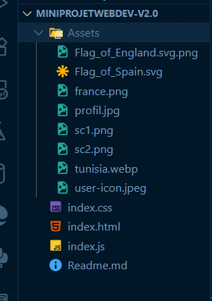

💼 CV Interactif — Fakher Neila

## 🌐 Démo en Ligne

🚀 Découvrez le projet en direct :  
👉 **[https://fakherneila.netlify.app/](https://fakherneila.netlify.app/)**

---
📋 Description

CV interactif moderne et responsive développé avec HTML5, CSS3, et JavaScript vanilla.
Ce projet présente mon parcours professionnel, mes compétences techniques et mes certifications de manière dynamique et attrayante, grâce à des animations fluides et des fonctionnalités interactives avancées.

✨ Fonctionnalités Principales
🎨 Interface & Design

Design moderne : Interface épurée avec animations fluides et micro-interactions

Responsive design : Adaptation parfaite sur mobile, tablette, et desktop

Mode clair/sombre : Basculable avec persistance via localStorage

Animations avancées : Effets hover, scroll animations, et transitions CSS3

⚡ Fonctionnalités JavaScript

📊 Barres de compétences animées : Progression visuelle déclenchée au scroll

📄 Téléchargement PDF dynamique : Export du CV en PDF via html2pdf.js

🌙 Mode clair/sombre persistant : Sauvegarde des préférences utilisateur avec localStorage

🔗 Navigation fluide : Défilement smooth entre les sections via ancres

📖 Affichage conditionnel : Détails d’expériences et projets affichés au clic

⏰ Timeline interactive : Parcours professionnel animé au défilement

🔧 Filtrage des compétences : Tri par catégorie (Frontend, Backend, Database, Tools)

🛠️ Fonctionnalités Techniques

HTML5 sémantique : Structure claire, accessible et optimisée pour le SEO

CSS3 moderne : Utilisation de variables CSS, Grid, Flexbox, et animations keyframes

JavaScript Vanilla : Manipulation du DOM, gestion d’événements, et utilisation de l’Intersection Observer API

Version imprimable optimisée : Feuille de style CSS print dédiée pour export papier/PDF

🧰 Stack Technologique
🖥️ Frontend

HTML5 – Structure sémantique et accessible

CSS3 – Variables, Grid, Flexbox, animations, media queries

JavaScript (ES6+) – Modules, classes, async/await, localStorage

📚 Bibliothèques & Outils

Font Awesome 6.5 – Icônes vectorielles modernes

Google Fonts (Poppins) – Typographie élégante

html2pdf.js – Génération de PDF côté client

🎯 Sections du CV
👤 En-tête Personnel

Photo professionnelle avec animation flottante

Informations de contact complètes

Liens sociaux : LinkedIn, GitHub

Boutons pour imprimer ou télécharger le CV en PDF

💼 Expériences Professionnelles

Timeline interactive avec animations au scroll

Détails supplémentaires affichés au clic

Organisation chronologique inversée

Effets de hover et indicateurs visuels dynamiques

🛠️ Compétences Techniques

Frontend : Angular, React, Vue.js, TypeScript, JavaScript, HTML5, CSS3
Backend : Node.js, Express.js, Spring Boot, PHP, REST APIs
Bases de Données : MySQL, MongoDB, PostgreSQL, SQL
Outils & Sécurité : Git, Docker, OWASP, CTF, Web Security

🌐 Fonctionnalités Interactives

Filtrage dynamique des compétences par catégorie

Barres de progression animées avec pourcentages visuels

Affichage conditionnel des projets et expériences

Thème clair/sombre avec icône dynamique

🚀 Installation et Utilisation

🔹 Méthode Simple

# Cloner le repository
git clone [url-du-repo]
cd MINIPROJETWEBDEV

# Ouvrir le fichier dans le navigateur
open index.html
# ou
firefox index.html
# ou
chrome index.html

🔹 Serveur Local (Recommandé)

Utilisez un serveur local (ex : Live Server sur VS Code) pour un rendu optimal des animations, des interactions et du mode PDF.

🧾 Notes Techniques

Les préférences utilisateur (thème clair/sombre) sont enregistrées localement via localStorage.

La génération du PDF est entièrement côté client avec html2pdf.js.

Les animations au scroll sont gérées grâce à l’Intersection Observer API.

Un CSS print spécifique garantit un rendu imprimable professionnel.

## 📁 Structure du Projet

Voici la structure actuelle du projet :

